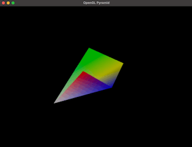

# Pyramid Shape Model

A 3D pyramid model with a parallelogram base, developed in C++ on Xcode for Mac ARM. The model supports rotation using the WASD keys, allowing interactive exploration of the pyramid's structure. 

***Library setup instructions for creating new project can be found [here](https://github.com/ESBehtev/FlatShapeModel).***

# Continuation 

The next project demonstrates a 3D pyramid model with a parallelogram base, featuring PNG textures and auto-rotation. Additionally, a directional light source moves along an elliptical path on a defined plane, enhancing the visualization with dynamic lighting. Visit the repository: [Pyramid Shape Model Textured on GitHub](https://github.com/ESBehtev/Pyramid-Shape-Model-Textured).
